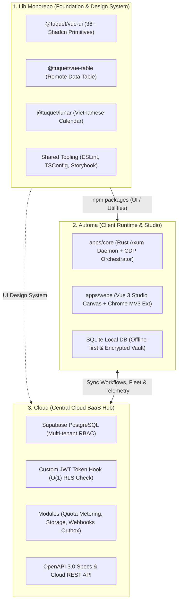

# 🗺️ Ecosystem Master Roadmap

> **Ecosystem:** Tuquet / Omni Creator  
> **Core Repositories:** `lib` | `automa` | `cloud` | `scoop-bucket`  
> **Mission:** Build a high-performance browser automation platform (Automation Engine), a shared UI/Core component library (Design System), and a central multi-tenant cloud orchestration hub (Cloud Multi-Tenant SaaS BaaS Hub).

---

## 🏛️ 1. Architecture Layering Map

---

## 📅 2. 3-Phase Roadmap Overview

| Phase       | Phase Name                                   | Focus                                                                                                             |        Status         |
| :---------- | :------------------------------------------- | :---------------------------------------------------------------------------------------------------------------- | :-------------------: |
| **Phase 1** | **Core Base & Foundation Hardening**         | Standardize foundation: UI Primitives, Remote Table, Rust Engine Core, RBAC Schema on Supabase, Dev Tooling.      | ✅ **100% COMPLETED** |
| **Phase 2** | **Cloud Integration & SaaS Sync**            | Connect `automa` to `cloud` via Supabase Adapter; launch Web Admin SaaS Dashboard; expand components.             |  🔥 **IN PROGRESS**   |
| **Phase 3** | **AI Agentic Automation & Distributed Grid** | AI Vision Autonomous Agent, self-healing CDP Selectors; distributed bot fleet orchestration; usage-based billing. |      🔮 Planned       |

---

## 🎯 3. Phase 1 Detailed Breakdown: Core Base & Foundation

> **Key Objective:** Deliver 100% solid, flawless foundation blocks before introducing cloud and AI layers. Ensure all tests pass, builds are clean, security is verified, and architecture is consistent across repositories.

### 📦 Workstream 1.1: `lib` (Shared Libraries & Design System)

_Ownership: Ensure absolute reliability, zero styling technical debt, and maximum reusability._

- [x] **Monorepo Architecture:** Configured Turborepo + pnpm workspace, `tsup` Dual ESM/CJS build pipeline, `publint` exports validation.
- [x] **`@tuquet/vue-ui`:**
  - [x] Integrated 36+ Shadcn-Vue primitives powered by Reka UI & Tailwind CSS.
  - [x] Integrated Sonner Toaster and multi-theme Design Tokens (`tokens.css`).
  - [x] Invariant established: Never mutate base component styling directly; maintain 1:1 parity with upstream registry.
- [x] **`@tuquet/vue-table`:**
  - [x] Integrated TanStack Table v8, Virtual Scroll, URL Sync, AbortController.
  - [x] Multi-format export: XLSX, CSV, TSV.
  - [x] Test suite: 138/138 tests passed across 21 test files.
- [x] **`@tuquet/lunar`:** High-precision astronomical Lunar-Solar calendar converter, Sexagenary Cycle (Can Chi), 24 Solar Terms (17/17 tests passed).
- [x] **Showcase & CI/CD:** Storybook online (`storybook.tuquet.com`), automated Changesets releases to npm registry via GitHub Actions.
- [ ] **[Next Tasks - Hardening]**:
  - [ ] Mobile responsive layout testing and keyboard navigation shortcuts for data table.
  - [ ] Additional Storybook stories covering edge cases for Dynamic Filters.

---

### ⚡ Workstream 1.2: `automa` (Local Execution Engine & Studio)

_Ownership: High-performance workstation automation engine with complete browser process isolation._

- [x] **Architecture & SRS:**
  - [x] 7 Golden Invariants mental model.
  - [x] 2D Matrix Specification Hub (`docs/srs/`): Horizontal Standards (Buttons, Selects, Stores, UI) & Vertical Menus (Studio, Browsers, Campaign, Storage, History, Settings).
- [x] **Local Storage & Cryptographic Vault:**
  - [x] SQLite database-first: Centralized entity management, eliminating raw file-scanning anti-patterns.
  - [x] Cryptographic vault: `HMAC-SHA256 + AES-256-CBC`, RAM-only decryption during microsecond execution, zero leak to disk/logs.
- [x] **Browser Process Isolation (Chromium Isolation):**
  - [x] Download and manage isolated Chromium binary per Playwright architecture model (never scanning or commandeering personal host browsers).
- [x] **Distribution:** Packaged Scoop bucket manifest (`automa.json`) and pre-built binaries via GitHub Releases.
- [x] **Rust Core Toolchain:** Configured and activated GNU toolchain (`stable-x86_64-pc-windows-gnu`) with Scoop MinGW GCC; `cargo check` compiles 100% of `apps/core` with zero errors.
- [ ] **[Next Tasks - Core Base Focus]**:
  - [ ] **Local Daemon End-to-End Test:** Run integration tests verifying Axum Daemon (`127.0.0.1:8765`), Scalar API Server (`:8767`), and Web Studio Canvas (`apps/webe`).
  - [ ] **Shadcn Consumption Alignment:** Ensure `apps/webe` consumes primitives directly from `@tuquet/vue-ui` and `@tuquet/vue-table` without duplicate definitions.

---

### ☁️ Workstream 1.3: `cloud` (Multi-Tenant RBAC Cloud Platform & BaaS Hub)

_Ownership: Centralized multi-tenant authorization, standardized data models on Supabase._

- [x] **Standardized Identity:** Positioned as `cloud` — the Central Cloud BaaS Hub for the entire ecosystem.
- [x] **Multi-Tenant RBAC Schema Design:**
  - [x] Completed PostgreSQL schema (`tenants`, `profiles`, `roles`, `permissions`, `member_roles`, `tenant_invitations`, `audit_logs`, `projects`).
  - [x] Clear architectural separation between System Roles (`tenant_id IS NULL`) and Custom Tenant Roles (`tenant_id = UUID`).
- [x] **RLS Security & Performance:**
  - [x] Eliminated RLS Infinite Recursion using `SECURITY DEFINER` helper functions (`is_tenant_member`, `has_tenant_permission`, `is_tenant_admin`).
  - [x] Integrated Supabase Custom Access Token (JWT) Hook embedding `tenant_id` and roles into claims for $O(1)$ authorization checks.
  - [x] Composite indexing prefixed with `tenant_id` on all business tables, eliminating cross-tenant leakage and preparing for Table Partitioning.
- [x] **SQL Extension Modules (Plug & Play):**
  - [x] `01_media_storage_assets.sql`: Media asset management & isolated Storage RLS policies.
  - [x] `02_subscriptions_entitlements.sql`: Subscription tiers and automated quota enforcement for `projects`.
  - [x] `03_outbox_webhooks_queue.sql`: Asynchronous outbox event queue and webhook dispatch.
  - [x] `04_soft_delete_pattern.sql`: Standardized soft-delete (`deleted_at`) and restoration triggers.
- [x] **OpenAPI Specification:** Standardized OpenAPI 3.0.3 specification (`docs/openapi_spec_rbac.json`).
- [ ] **[Next Tasks - Core Base Focus]**:
  - [ ] Run automated migration tests against local Supabase Docker instance (`supabase start` && `supabase db reset`).
  - [ ] Generate TypeScript Client SDK from `openapi_spec_rbac.json` for client consumers.

---

### 🛠️ Workstream 1.4: Developer Tooling & Environment Standardization

_Ownership: Consistent, standardized development environment and developer ergonomics._

- [x] **VS Code Workspace Standardization:**
  - [x] Configured `"search.useIgnoreFiles": false` alongside strict artifact exclusion lists in `.vscode/settings.json`.
  - [x] Standardized build and test tasks in `.vscode/tasks.json`.

---

## 🚀 4. Phase 2 Plan (Cloud Integration & SaaS Sync)

1. **Supabase Remote Adapter in `automa`:**
   - Establish cloud synchronization layer running in parallel with local SQLite.
   - Enable users to sync workflows, campaign templates, and run logs to their Cloud Creator account.
2. **SaaS Admin Web Dashboard:**
   - Build web management portal for organization administration, member permissions, bot license keys, and quota monitoring via `cloud`.
3. **UI Components Expansion in `lib`:**
   - Add Analytics Charts, Agent Flow Node components, and Command Palette (`Cmd+K`).

---

## 🔮 5. Phase 3 Plan (AI Agent & Distributed Grid)

1. **AI Vision & Self-Healing Automation (`automa`):**
   - Integrate multi-modal AI models for self-healing element selectors when target DOM trees change.
   - Solve complex interaction barriers autonomously (CAPTCHAs, dynamic multi-step verification flows).
2. **Distributed Runner Grid (`cloud`):**
   - Orchestrate fleets of distributed `automa` bot runners globally via WebSocket and Supabase Realtime.
   - Integrate payment gateways and usage-based billing (Pay-as-you-go).
3. **Headless Cross-Platform UI (`lib`):**
   - Package Desktop (Tauri) and multi-browser Web Extension distributions with $\ge 90\%$ test coverage.

---

## 📜 6. Development Invariants

1. **Strict ASCII Invariance:** All PowerShell scripts, environment variables, and CLI configurations use ASCII characters to ensure compatibility with Windows PowerShell 5.1.
2. **Scoop-First Tooling:** Manage developer toolchains (`nodejs`, `pnpm`, `rustup`, `supabase`, `mingw`) primarily through Scoop.
3. **No Direct UI Style Mutation:** Never mutate atomic component styles in `@tuquet/vue-ui` directly; all theming is handled through Design Tokens (`tokens.css`).
4. **Zero-Leak Credentials:** All secret keys, tokens, and passkeys are decrypted in RAM only during active execution, never written to disk or printed to logs.
