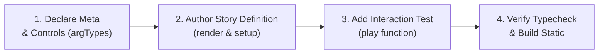

# Component Development Guide with Storybook (Lib Monorepo)

This document provides verified standards, workflows, and technical solutions for developing, documenting, and automatically testing Vue 3 components with Storybook 8+ in the `@tuquet` monorepo.

---

## 1. 🎯 Core Principles & Monorepo Architecture

1. **Co-location Story Files**:
   - All Storybook files are placed adjacent to their corresponding components:
     - Table and filter components: `packages/vue-table/src/components/*.stories.ts`
     - UI primitives: `packages/vue-ui/src/components/ui/**/*.stories.ts`
   - Central Storybook server runs in `apps/storybook` (Port 6006 / 6007).

2. **CSF3 (Component Story Format v3) Compliance**:
   - Use strict type declarations: `Meta<typeof Component>` and `StoryObj<typeof meta>`.
   - Provide comprehensive `argTypes` controls enabling users to customize props directly in the canvas.

3. **Master Story for Composite Components**:
   - Rather than creating numerous fragmented stories, build **1 Comprehensive Master Story** (such as `AllInOneEnterpriseTable`), reflecting real-world workflows (Remote fetch, Virtual scroll, Column pinning, Density toggle, Bulk actions, Export, and Inline cell editing).

---

## 2. ⚡ 4-Step Story Development Lifecycle



### Step 1: Declare Meta & Comprehensive Controls

- Set `title` matching category hierarchy, e.g., `'Vue Table/DataTable'` or `'Vue UI/RangeCalendar'`.
- Define explicit `argTypes` for interactive parameters (boolean, select, range, inline-radio) with clear English descriptions and `table.category` grouping.
- See: [Controls & ArgTypes Reference](./references/controls-and-args.md)

### Step 2: Author Story Definition with Render Function and Setup

- Register all dependent child components in `components: { ... }`.
- Initialize reactive state, watchers (`watch(() => args.prop)`), and methods in `setup()`.
- Keep template HTML clean and intuitive.
- ⚠️ **CRITICAL INVARIANT**: **NEVER** use the `as` keyword (TypeScript type assertion) inside HTML template strings. Perform all type assertions in `setup()`.
- See: [CSF3 Vue Standards](./references/csf3-vue-standards.md) and [Common Pitfalls Reference](./references/common-pitfalls.md)

### Step 3: Implement Automated Interaction Tests (`play` function)

- Use `@storybook/test` utilities: `step`, `within`, `userEvent`, `expect`.
- Structure test suites into distinct steps: Mount assertion, debounced search typing, row selection, dropdown menus, jump-to-row, inline editing.
- See: [Interaction Testing Reference](./references/interaction-testing.md)

### Step 4: Verification and Static Build

- Run monorepo typecheck: `pnpm typecheck`
- Run unit tests: `pnpm test`
- Validate story syntax: `node skills/storybook/scripts/validate-stories.mjs`
- Launch dev server: `pnpm storybook`

---

## 3. 📚 Reference Guides (`references/`)

Consult detailed technical references for deep dives into specific topics:

| Reference Document                                                      | Primary Scope                                                                            |
| :---------------------------------------------------------------------- | :--------------------------------------------------------------------------------------- |
| 📖 [CSF3 Vue Standards](./references/csf3-vue-standards.md)             | TypeScript structure, render functions, reactivity, dynamic mock datasets                |
| 🎛️ [Controls & ArgTypes](./references/controls-and-args.md)             | Configuring controls: boolean, select, range, inline-radio, category grouping            |
| 🧪 [Interaction Testing](./references/interaction-testing.md)           | Writing play functions with step, userEvent, expect simulating user interactions         |
| 🎨 [Layout & Styling](./references/layout-and-styling.md)               | Fixed table layout, column pinning, density resilience, group hover, inline editing      |
| 🚀 [Enterprise Table Stories](./references/enterprise-table-stories.md) | Story recipes for Table API Facade, Saved Views, Mobile Card View, Plugins, Dynamic Form |
| ⚠️ [Common Pitfalls](./references/common-pitfalls.md)                   | Runtime issues (such as `as` in templates) and verified remedies                         |

---

## 4. 📋 Production Templates (`templates/`)

Use pre-built templates for rapid development:

- [simple-component.story.ts](./templates/simple-component.story.ts): For atomic components (Button, Badge, Input, Card).
- [data-grid.story.ts](./templates/data-grid.story.ts): For complex data tables (Virtual scrolling, Pinning, Density, Inline edit).
- [form-controls.story.ts](./templates/form-controls.story.ts): For advanced input controls (RemoteCombobox, DateRange).

---

## 5. 🛠️ Automation & Verification Commands

- Validate story syntax:
  ```bash
  node skills/storybook/scripts/validate-stories.mjs
  ```
- Launch Storybook dev server:
  ```bash
  pnpm storybook
  ```
- Build Storybook static production output:
  ```bash
  pnpm build:storybook
  ```
- Preview static production build:
  ```bash
  pnpm preview:storybook
  ```
